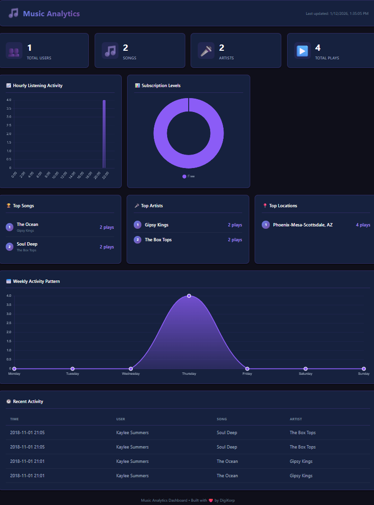

# 📊 Music Analytics Dashboard

A modern, responsive web dashboard for visualizing music streaming analytics.



## Features

- **Real-time Stats** - Total users, songs, artists, and plays
- **Hourly Activity Chart** - See when users listen most
- **Weekly Patterns** - Day-by-day listening trends
- **Top Charts** - Most played songs, artists, and locations
- **Subscription Analytics** - Free vs Paid user distribution
- **Recent Activity Feed** - Live listening history

## Tech Stack

- **HTML5** - Semantic structure
- **CSS3** - Modern dark theme with glassmorphism
- **JavaScript** - Dynamic data loading and rendering
- **Chart.js** - Beautiful, responsive charts

## Quick Start

### 1. Generate Dashboard Data

```bash
python dashboard/generate_data.py
```

This queries the database and creates `dashboard/data/dashboard_data.json`.

### 2. Start Local Server

```bash
cd dashboard
python -m http.server 8080
```

### 3. View Dashboard

Open [http://localhost:8080](http://localhost:8080) in your browser.

## File Structure

```
dashboard/
├── index.html          # Main HTML structure
├── styles.css          # Dark theme styling
├── dashboard.js        # Data loading & chart rendering
├── generate_data.py    # Python script to export data from DB
├── data/
│   └── dashboard_data.json    # Generated data file
└── assets/
    └── dashboard_screenshot.png
```

## Data Refresh

To update the dashboard with latest data:

```bash
python dashboard/generate_data.py
```

Then refresh the browser.

## Customization

### Colors

Edit CSS variables in `styles.css`:

```css
:root {
    --accent-primary: #8b5cf6;
    --accent-secondary: #a78bfa;
    --bg-primary: #0f0f1a;
    /* ... */
}
```

### Charts

Modify Chart.js options in `dashboard.js` to customize chart appearance.
